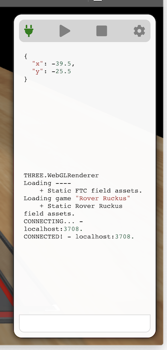

# **Introduction**

Birdseye Viewer is a utility targeted to participants in the FIRST Tech Challenge robotics competition. Its aim to to ease some of the inefficiencies and tediousness that arises while developing the robot - particularly the autonomous programs.

The foremost function of Birdseye Viewer is to provide the user with a 3D rendering of their robots position on the FTC field in real time. Those data can be generated however you like, but we also provide Birdseye Server and Birdseye Tracker which can do it all for you.

# **JSON Data Reference**

Below is a quick reference for the JSON data the Birdseye Viewer consumes. For basic functionality, only keys *x* and *y* are strictly necessary. These represent the position of the robot on the field. Optionally, *z* can also be provided to raise the robot off the field. *Pitch, Roll*, and *Heading* are also correctly reflected in the rendering. However, none of these inputs are required.

|Key|Type|Range|Description|
|---|---|---|---|
|x|number|-144,144|The X position of the robot relative to the field's coordinate system.
|y|number|-144,144|The Y position of the robot relative to the field's coordinate system.
|z|number|0,Infinity|The Z position of the robot relative to the field's coordinate system.
|pitch|number|-180,180|The rotation of the robot around the X axis of its own coordinate system.
|roll|number|-180,180|The rotation of the robot around the Y axis of its own coordinate system.
|heading|number|-180,180|The rotation of the robot around the Z axis.
|input|object||An object with keys x,y, and z indicating the input to the robot on each of those axes. See below for more detail.
|target|object||An object with keys x,y,z,pitch,roll, and heading indicating the intended destination of the robot. See below for more detail.

-Example-

    {
        x: 34.2,
        y: 55.1,
        z: 0.5
        pitch: 0,
        roll: 0,
        heading: 153,
        input: {
            x: 0.4,
            y: 0,
            z: 1
        },
        target: {
            x: 40,
            y: 60,
            z: 0,
            heading: 90
        }
    }

## **Extensibility**

One of the great things about the structure of Birdseye is that really, you can send to it any data you wish. If you would like to transmit more verbose diagnostic detail, you can throw it all into the data you send to Birdseye Viewer. Further, because Birdseye is open-source, it can be extended to actually respond to that data however you like using simple JavaScript. Unrecognized keys will simply be displayed on screen in a cleanly formatted JSON view.

